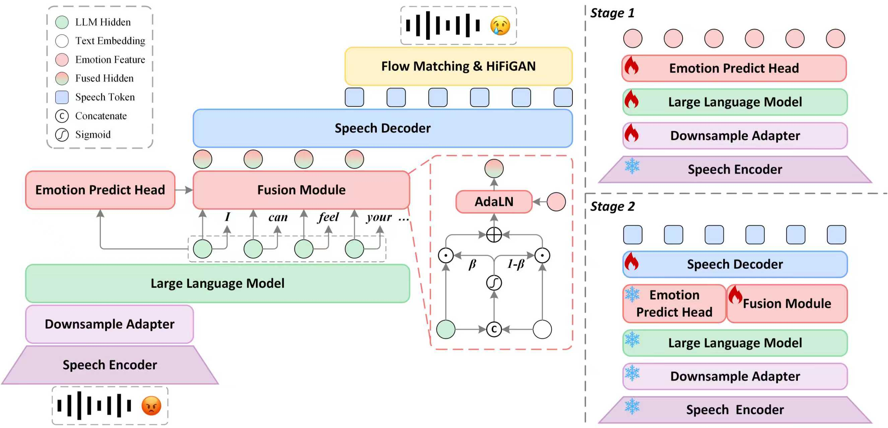

# EMPATHY OMNI: ENABLING EMPATHETIC SPEECH RESPONSE GENERATION THROUGH LARGE LANGUAGE MODELS


[](https://arxiv.org/abs/2508.18655)
[](https://github.com/ictnlp/LLaMA-Omni)
[](https://huggingface.co/ICTNLP/Llama-3.1-8B-Omni)


We present EMPATHY OMNI, a speech–language model based on Qwen2.5-Instruct that supports low-latency, high-quality empathetic interaction, jointly generating textual and acoustic responses from speech inputs.

<div align="center"></div>


## Install

1. Clone this repository.

```shell
git clone https://github.com/W311411/Empathy-Omni
cd Empathy-Omni
```

2. Install packages.

```shell
conda create -n Eomni python=3.10
conda activate Eomni
pip install pip==24.0
pip install -
```

3. Install `fairseq`.

```shell
git clone https://github.com/pytorch/fairseq
cd fairseq
pip install -e . --no-build-isolation
```

4. Install `flash-attention`.

```shell
pip install flash-attn --no-build-isolation
```

## Quick Start

1. Download our model from 🤗[Huggingface](). 

2. Download the `Whisper-large-v3` model from 🤗[Huggingface](https://huggingface.co/openai/whisper-large-v3).
   
3. Download the `Emotion2vecs` model from 🤗[Huggingface](https://huggingface.co/emotion2vec/emotion2vec_base).

4. Speech tokens are rendered to the final waveform using CosyVoice2’s flow-matching vocoder.

Inference requires CosyVoice2-0.5B, available on [HuggingFace](https://huggingface.co/FunAudioLLM/CosyVoice2-0.5B).


## Local Inference


```bash
python3 omni_speech/infer/Eomni.py --query_audio ./omni_speech/infer/esd_male.wav 
## s2s
python3 omni_speech/infer/Eomni.py --query_audio ./omni_speech/infer/esd_male.wav --s2s --save_dir ./
```
